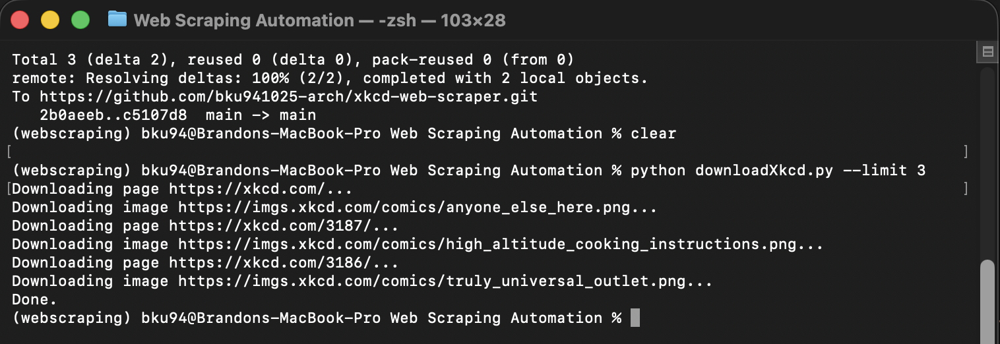

# XKCD Web Scraper (Python)

A Python command-line tool that automatically downloads XKCD comics by scraping the official website and following the “Previous” links until the first comic.

This project aims to produce a automated web scraper coupled with production-quality features such as robust URL handling, command-line arguments, and safe network behavior.

---
## Quick Start
```bash
pip install -r requirements.txt
python downloadXkcd.py --limit 5
```

---
## Features

- Downloads XKCD comic images automatically
- Follows the “Previous” link until the first comic
- Handles protocol-relative and relative URLs correctly
- Skips already-downloaded images
- Supports configurable output directory
- Optional download limit for testing or partial runs
- Uses timeouts to avoid hanging network requests

---

## Requirements

- Python 3.9+
- `requests`
- `beautifulsoup4`

Install dependencies:

```bash
pip install requests beautifulsoup4
```

---

## Demo
